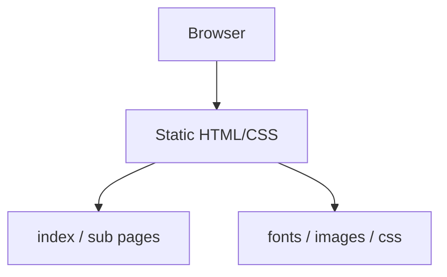

# Ansan Culture Tour Static Website

HTML/CSS 학습 초기에 제작한 안산 문화관광 정적 웹사이트입니다. 백엔드나 빌드 도구 없이 여러 정적 페이지, 공통 헤더/메뉴/푸터, 관광 콘텐츠 카드, 로그인 UI를 직접 구성했습니다.

## 1. 프로젝트 개요

- 주제: 안산 문화관광 정보 제공 웹사이트
- 형태: 정적 웹사이트
- 개발 목적: 공공기관형 관광 사이트의 정보 구조, GNB/LNB, 서브 페이지, 반응형 레이아웃 구현 연습
- 핵심 성격: 초기 퍼블리싱 역량과 HTML/CSS 화면 구조화 과정을 보여주는 학습 프로젝트
- 저장소: https://github.com/woongpro416/ansan-culture-tour

## 2. 주요 기능

- 메인 비주얼, 관광 명소, 여행 정보, 배너 영역 구성
- 안산 12경, 안산 BIG5 가치, 안산시티투어 서브 페이지 구성
- 공통 헤더, GNB, LNB, 푸터 반복 구현
- 관광지 카드, 표, 탭형 콘텐츠, radio/hover 기반 UI 구성
- 로그인 화면 UI 마크업
- 반응형 CSS를 통한 화면 폭별 레이아웃 조정

## 3. 담당 역할

- 메인 페이지와 주요 서브 페이지 HTML/CSS 구현
- 공통 레이아웃과 메뉴 구조 작성
- 관광 콘텐츠 이미지, 카드, 표, 텍스트 영역 배치
- 누락 CSS 참조와 미구현 링크를 정리해 로컬 실행 가능 상태로 보완
- 포트폴리오용 README, 실행 방법, 한계 사항 정리

## 4. 기술 스택

| 영역 | 기술 |
| --- | --- |
| Frontend | HTML5, CSS3 |
| UI | 반응형 CSS, radio/hover interaction |
| Assets | 로컬 이미지, 로컬 웹폰트 |
| Deploy | GitHub Pages 정적 배포 |

## 5. 시스템 아키텍처



## 6. ERD

DB를 사용하지 않는 정적 웹사이트이므로 ERD는 없습니다.

## 7. API 명세

백엔드 API를 사용하지 않는 정적 웹사이트입니다. 로그인 화면은 실제 인증 기능이 없는 UI 마크업입니다.

## 8. 실행 방법

브라우저에서 `index.html`을 직접 열어 확인할 수 있습니다.

로컬 서버로 확인하려면 프로젝트 루트에서 실행합니다.

```bash
python -m http.server 8000
```

접속 주소:

```text
http://localhost:8000/index.html
```

## 9. 테스트 / 검증 방법

- `index.html`, `sub1.html`, `sub12.html`, `sub21.html`, `log.html` 직접 이동 확인
- 이미지, 폰트, CSS 상대 경로 깨짐 여부 확인
- 미구현 링크가 404로 이동하지 않는지 확인
- PC / 모바일 폭에서 레이아웃이 크게 깨지지 않는지 확인

## 10. 트러블슈팅

- 존재하지 않는 CSS 참조를 제거하고 실제 파일명 기준으로 정리했습니다.
- 미구현 내부 페이지 링크는 404 이동을 막기 위해 비활성 처리했습니다.
- 중복 테이블 종료 태그와 잘못된 CSS 값을 수정했습니다.
- 정적 사이트 특성상 공통 컴포넌트 분리가 없어 반복 HTML이 발생하는 한계를 README에 명시했습니다.

## 11. 배포 / 링크

- GitHub: https://github.com/woongpro416/ansan-culture-tour
- Live Page: https://woongpro416.github.io/ansan-culture-tour/

## 12. 한계와 개선 방향

- 빌드 도구, 컴포넌트 분리, 템플릿 엔진, 백엔드가 없습니다.
- 로그인은 UI만 구현되어 실제 인증이 없습니다.
- 시맨틱 마크업, 접근성, 모바일 메뉴 완성도는 개선 여지가 있습니다.
- 공통 헤더/푸터를 별도 include 구조나 컴포넌트로 분리하면 유지보수성이 좋아집니다.
- 정적 JSON 또는 간단한 API를 연결하면 관광 콘텐츠를 데이터 기반으로 관리할 수 있습니다.