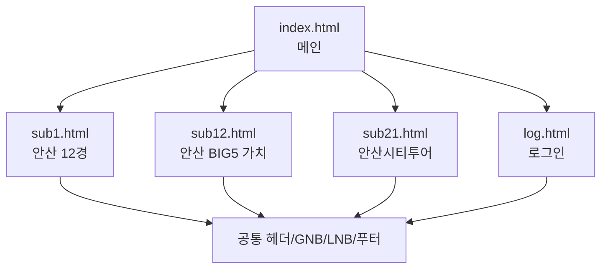

# Ansan Culture Tour Static Website

학원 첫 달에 HTML/CSS 중심으로 제작한 안산 문화관광 웹사이트 클론/리디자인 프로젝트입니다. 백엔드나 빌드 도구 없이 정적 페이지와 이미지 자산만으로 구성되어 있으며, 포트폴리오에서는 초기 퍼블리싱 역량과 반응형 레이아웃 연습 과정을 보여주는 프로젝트로 정리합니다.

## 프로젝트 개요

- 주제: 안산 문화관광 정보 제공 웹사이트
- 형태: 정적 웹사이트
- 주요 기술: HTML5, CSS3, 반응형 CSS, CSS radio/hover 인터랙션
- 주요 자산: 로컬 폰트, 배너 이미지, 관광지 이미지
- 제작 목적: 관광 안내 사이트의 메인/서브 페이지 구조, GNB/LNB, 비주얼 영역, 콘텐츠 카드, 푸터를 직접 구현

## 구현 범위

| 페이지 | 파일 | 내용 |
| --- | --- | --- |
| 메인 | `index.html` | 메인 비주얼, 관광 명소 섹션, 여행정보 섹션, 관련 배너 |
| 관광명소 | `sub1.html` | 안산 12경 목록형 콘텐츠 |
| 관광명소 | `sub12.html` | 안산 BIG5 가치 콘텐츠 |
| 테마여행 | `sub21.html` | 안산시티투어 안내, 요금 표 |
| 이용안내 | `log.html` | 로그인 화면 마크업 |

`privacy.html`, `sub11.html`은 학습 과정에서 남은 참고/미정리 템플릿 성격의 파일입니다. 현재 포트폴리오 대표 범위에는 포함하지 않습니다.

## 실행 방법

별도 설치 과정은 없습니다. 정적 파일이므로 `index.html`을 브라우저에서 바로 열 수 있습니다.

로컬 서버로 확인하려면 프로젝트 루트에서 다음 중 하나를 사용합니다.

```bash
python -m http.server 8000
```

브라우저에서 `http://localhost:8000/index.html`로 접속합니다.

VS Code Live Server 확장을 사용해도 됩니다.

## 링크

- GitHub: https://github.com/woongpro416/ansan-tour-live
- Live Demo: https://woongpro416.github.io/ansan-tour-live/

## 폴더 구조

```text
.
├── index.html
├── sub1.html
├── sub12.html
├── sub21.html
├── log.html
├── common.css
├── responsive.css
├── main.css
├── main2.css
├── sub_common.css
├── sub2common.css
├── fonts/
└── output/
```

## 화면 구성



## 강조

- 순수 HTML/CSS만으로 공공기관형 관광 사이트의 정보 구조를 구성했습니다.
- 메인 페이지와 서브 페이지의 공통 헤더, 메뉴, 푸터를 반복 구현하며 레이아웃 구조를 익혔습니다.
- 관광지 카드, 탭형 콘텐츠, 라디오 버튼 기반 UI, 반응형 CSS를 실습했습니다.
- 이미지와 로컬 웹폰트를 직접 연결해 실제 사이트에 가까운 시각 구성을 시도했습니다.

## 현재 한계

- 빌드 도구, 컴포넌트 분리, 템플릿 엔진, 백엔드는 없습니다.
- 일부 GNB 하위 메뉴는 아직 구현되지 않아 `#` 링크로 비활성 처리했습니다.
- 로그인 화면은 UI 마크업만 있고 실제 인증 기능은 없습니다.
- `privacy.html`, `sub11.html`에는 다른 지역 관광 사이트 템플릿 흔적이 남아 있어 대표 페이지에서 제외합니다.
- 접근성, 시맨틱 마크업, 중복 HTML 제거, 모바일 메뉴 완성도는 추가 개선 여지가 있습니다.

## 마무리 작업 기록

- 누락된 CSS 파일 참조를 실제 존재하는 `fonts.css`로 정리했습니다.
- 존재하지 않는 `xeicon.css`, `sub2_common.css` 참조를 제거했습니다.
- 로컬 정적 실행에 맞도록 대표 페이지의 홈 링크를 `index.html`로 정리했습니다.
- 미구현 내부 페이지 링크는 404로 이동하지 않도록 비활성화했습니다.
- 잘못된 CSS 값과 중복 테이블 종료 태그를 수정했습니다.

## 배포 메모

정적 사이트라 Docker 컨테이너보다 GitHub Pages, Netlify, Vercel 정적 배포가 더 적합합니다. Docker가 꼭 필요하다면 Nginx로 정적 파일을 서빙하는 방식이면 충분하지만, 이 프로젝트 규모에서는 포트폴리오 링크용 정적 호스팅이 더 단순합니다.
